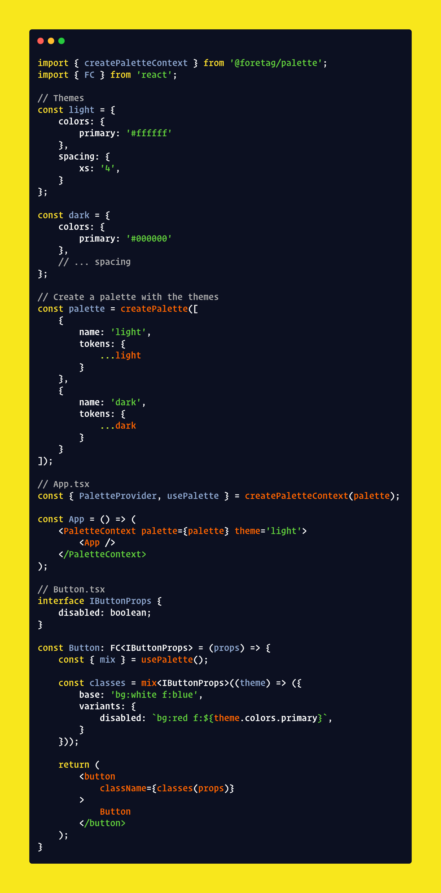

# Palette

Design tokens framework with atomic classes for React and Master CSS.

Deliver a consistent visual identity across your apps with design tokens, with your brand identity as code (BIaC) - from colors, typography, spacing or logos with your guidelines.

## Features

- Strongly typed end-to-end with TypeScript
- First class React and Master CSS support
- Minimal footprint: ~2KB with no dependencies
- Production ready
- Dynamic themes, switch on the fly

## Usage

## Tests

Palette is built with TypeScript and Bun, to run tests you need to run: `bun wiptest`

## Development

Palette is developed in TypeScript and is published on npm, it uses the Bun runtime for development and tests, but can be used in projects designed for other runtimes.